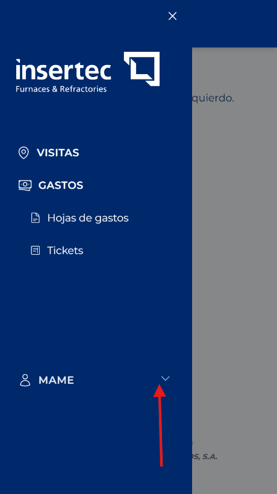
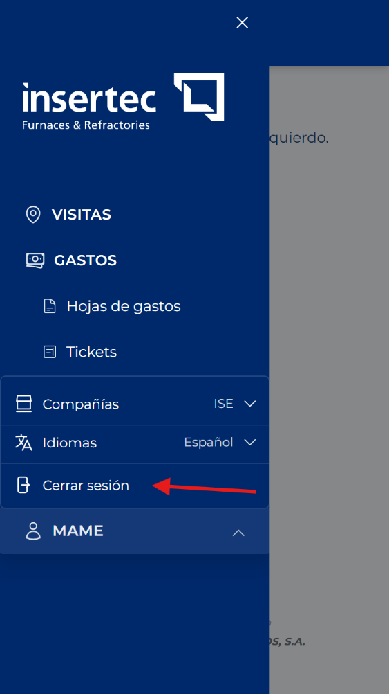

# Cerrar la sesión

<!-- Fuente: Manual App CRM 1.5.docx, sección 4.4. -->

1. Abra el menú lateral izquierdo.

2. Pulse su nombre de usuario en la parte inferior.

3. Pulse Cerrar sesión y espere hasta regresar a la pantalla de acceso.

