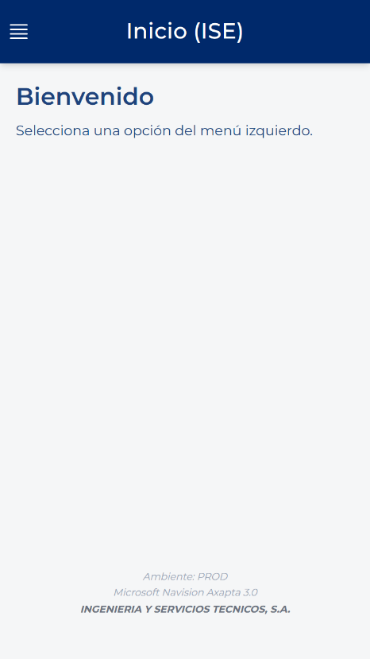

# Saioa hastea

<!-- Iturria: Manual App CRM 1.5.docx, 4.2 atala. -->

1. Ongi etorri pantailan, sakatu Sartu Microsoft-ekin.

2. Kontuen zerrenda bat agertzen bada, hautatu zure kontu korporatiboa.

3. Eskatzen bazaizu, idatzi pasahitz korporatiboa eta sakatu Hurrengoa edo Hasi saioa.

4. Egiaztapen gehigarri bat eskatzen bazaizu, onartu jakinarazpena autentifikazio-aplikazioan edo sartu jasotako kodea. Baliteke urrats hau sarbide guztietan ez agertzea.

5. Itxaron CRMaren orri nagusia agertu arte.

> **SEGURTASUNA:** Ez sartu inoiz eskuliburu honetako pantaila-argazki batean pasahitzik, egiaztapen-koderik, telefono-zenbaki pertsonalik edo informazio konfidentzialik.
