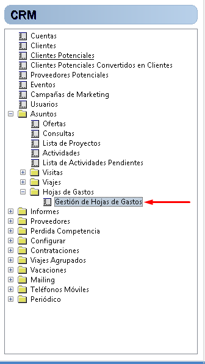
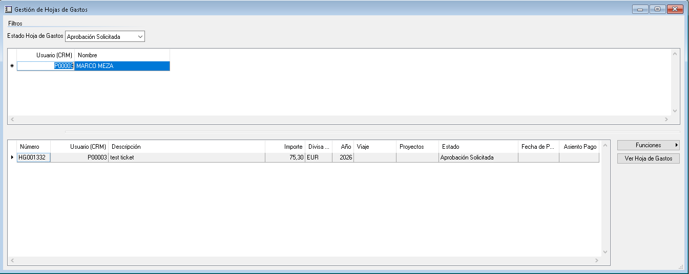
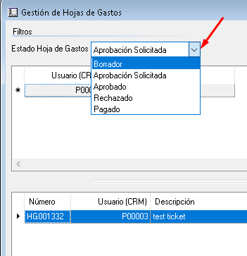

# Expense sheet management

<!-- Source: CRM App Manual 1.5.docx, section 11.2.2. -->

This new option is available from the menu: CRM / Inquiries / Expense Sheets / Expense Sheet Management.

A team manager can see authorized subordinates in the header of this form. A standard user can see only their own user. The form lines display all expense sheets belonging to the user selected in the header.

At the top there is an expense sheet status filter. It is a drop-down list containing all possible options:

