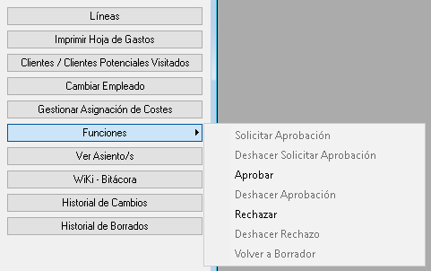

# Nota spese: CRM / Utenti / Nota spese

<!-- Fonte: Manual App CRM 1.5.docx, sezione 11.2.1. -->

È possibile eseguire un'azione direttamente nel modulo tradizionale della nota spese. Nella barra dei pulsanti sul lato destro, premere Funzioni per visualizzare le opzioni disponibili.

