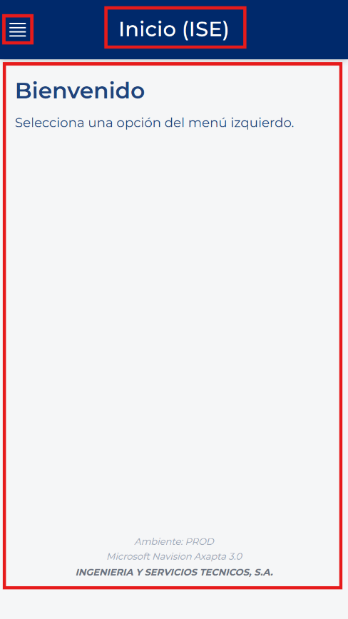
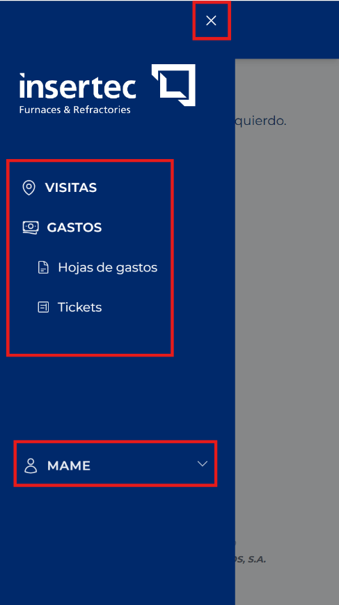
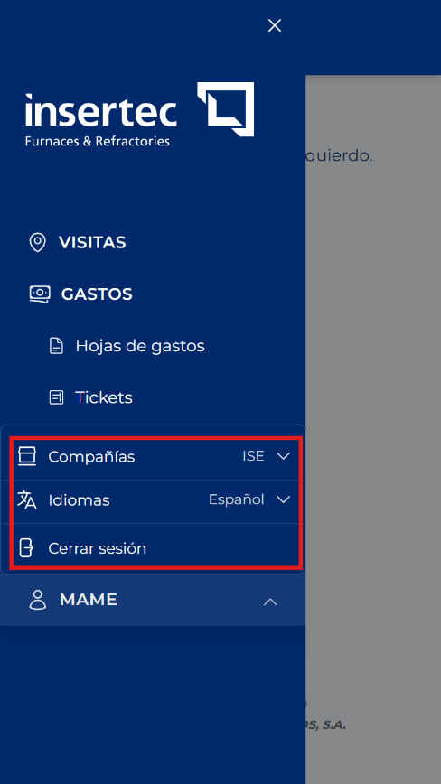

# 界面通用元素

<!-- 来源：Manual App CRM 1.5.docx，第 5 节。 -->

尽管各模块的字段不同，应用中会重复使用一些元素。了解一次后，阅读本手册其他部分会更加容易。

- 侧边菜单：通过菜单按钮打开；如果用户拥有相应权限，可从中进入“拜访”“费用”“费用单”和“票据”。

- 顶部栏：显示页面名称，还可能包含“返回”“创建”“编辑”“保存”“取消”“删除”“筛选”或“刷新”。

- 内容区：页面中央显示表单、筛选条件、卡片和结果的区域。

- 浮动按钮：通常位于右下角的圆形按钮，可用于创建记录或展开快捷操作。

- 确认消息：在执行重要操作前要求最后确认的窗口。

- 错误或权限消息：说明操作无法执行的原因。再次尝试前应先阅读这些消息。

