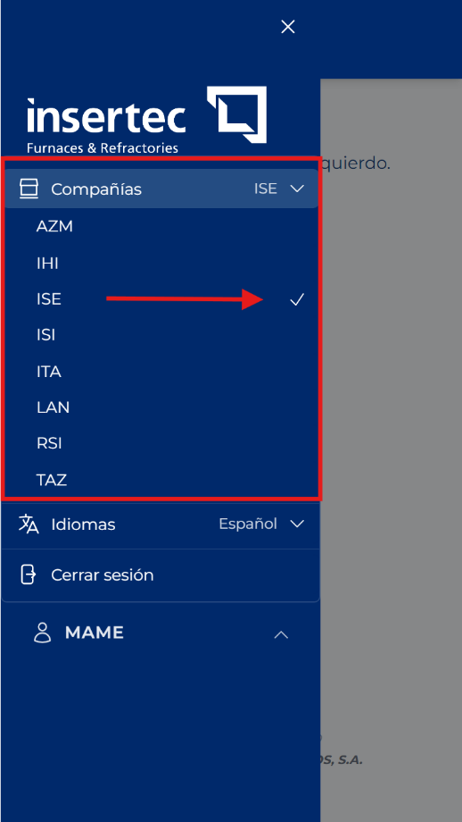

# What active company means

<!-- Source: CRM App Manual 1.5.docx, section 6.1. -->

The active company determines which customers, projects, currencies, visits, expense sheets, and tickets you can view. Before creating or searching for information, check that you are working in the correct company.

1. Open the side menu and press your username at the bottom.

2. Press Companies.

3. Select the authorized company you are going to work with.

4. Wait for the screen to refresh before continuing.

> **IMPORTANT:** Do not create a record if the active company is not correct. Changing company afterward does not automatically move a record that has already been created.
