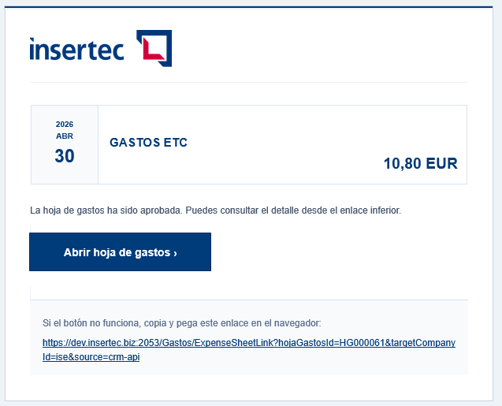

# Links received by email

<!-- Source: CRM App Manual 1.5.docx, section 10.5. -->

An approval email may include a direct link to the sheet. Press the link, sign in if prompted, and wait. The application may switch to the correct company before opening the details. The link does not grant additional permissions: you can view or act on the sheet only if your user account is authorized.

