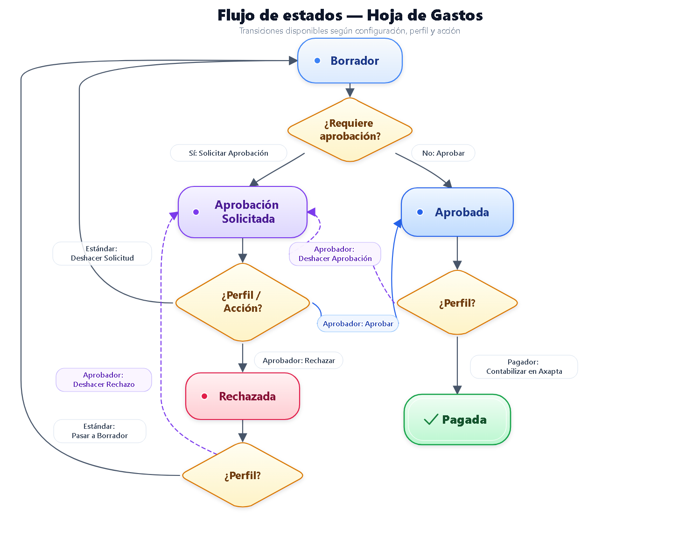

# General status flow

<!-- Source: CRM App Manual 1.5.docx, section 10.1. -->

<!-- Functional description reviewed against the screenshot in this section. -->

**Functional description of the diagram:**

- The diagram shows that the available transitions depend on the configuration, role, and action.
- From Draft, Request approval moves the sheet to Approval requested; when approval is not required, Approve moves it to Approved.
- From Approval requested, Undo request returns it to Draft, Approve moves it to Approved, and Reject moves it to Rejected.
- From Approved, Undo approval returns it to Approval requested and Post in Axapta moves it to Paid.
- From Rejected, Move to Draft returns it to Draft and Undo rejection returns it to Approval requested.

