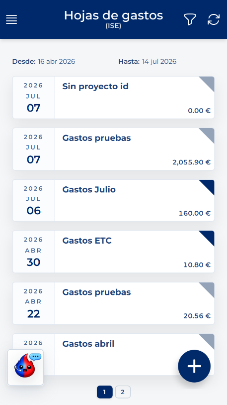
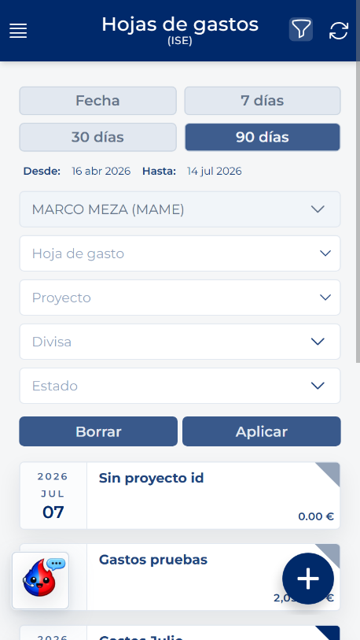
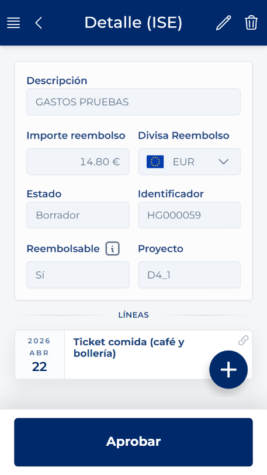

# Aprire l'elenco delle note spese

<!-- Fonte: Manual App CRM 1.5.docx, sezione 8.2. -->

1. Aprire il menu laterale.

2. In SPESE, premere Note spese.

3. Attendere che vengano visualizzate le schede. Ogni scheda può mostrare identificatore, descrizione, proprietario, data, valuta, importo, stato, progetto e giustificativo contabile, se presente.

