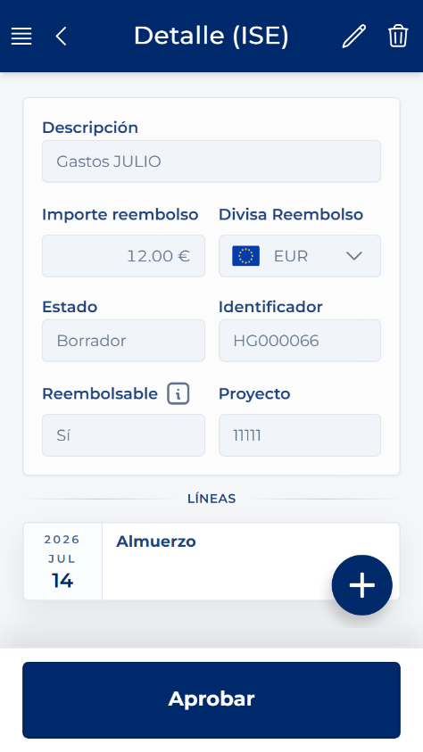
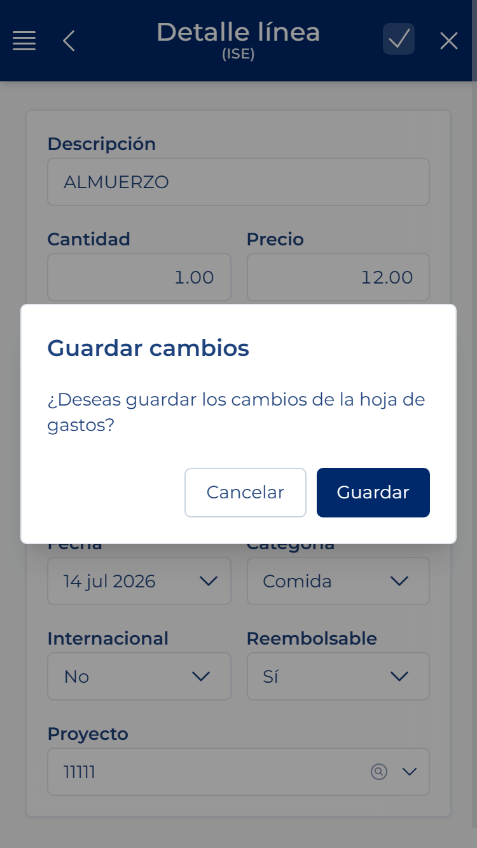
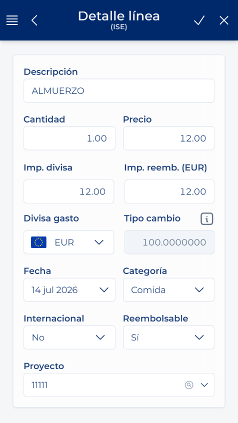

# Gastu-lerro bat eskuz gehitzea

<!-- Iturria: Manual App CRM 1.5.docx, 8.6 atala. -->

1. Editatu daitekeen orri batean, ireki Ekintza azkarrak eta sakatu Lerro berria.

2. Adierazi gastuaren Data.

3. Hautatu Kategoria egokia (kasu batzuetan kategoriak modu desberdinean definituta daude konpainia bakoitzean).

4. Idatzi Deskribapen argi bat.

5. Sartu Prezioa eta Kopurua. Berrikusi kalkulatutako zenbatekoa.

6. Hautatu Gastuaren dibisa eta berrikusi Dibisako zenbatekoa, Kanbio-tasa eta Itzulketaren zenbatekoa.

7. Bete Proiektua, Nazioartekoa, Itzulgarria eta dagozkion gainerako eremuak.

8. Sakatu Gorde eta berretsi.

NAHITAEZKO EREMUAK: Deskribapena eta kategoria bete behar dira. Prezioa eta Kopurua zero baino handiagoak izan behar dira. Km kategorian, prezioa konpainian ezarritako konfiguraziotik kalkula daiteke eta blokeatuta ager daiteke.
