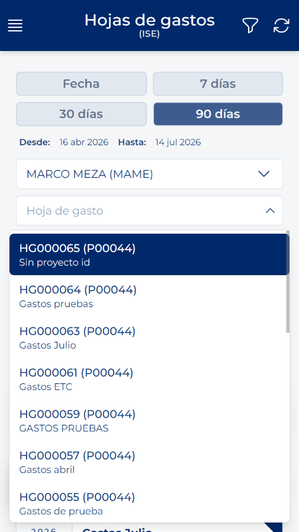
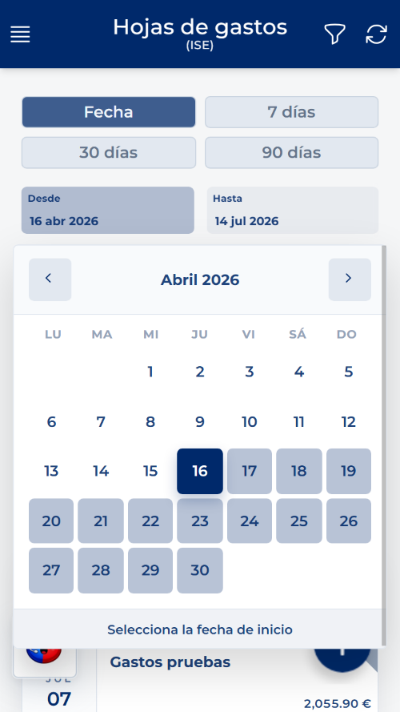
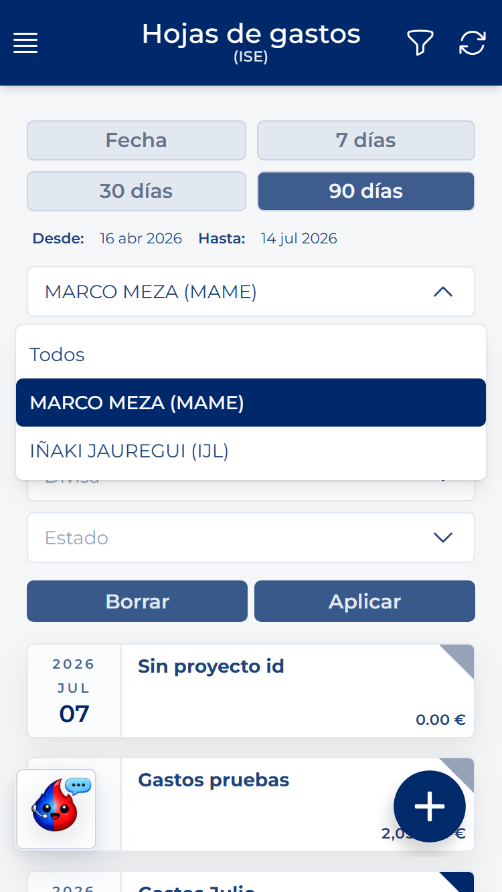

# Buscar y filtrar hojas

<!-- Fuente: Manual App CRM 1.5.docx, sección 8.3. -->

1. Pulse Filtro.

2. Utilice solo los campos necesarios: intervalo de fechas, Usuario si dispone de gestión de subordinados, Hoja de gasto, Proyecto, Divisa y Estado.

3. Pulse Aplicar.

4. Pulse Borrar para retirar todos los criterios.

