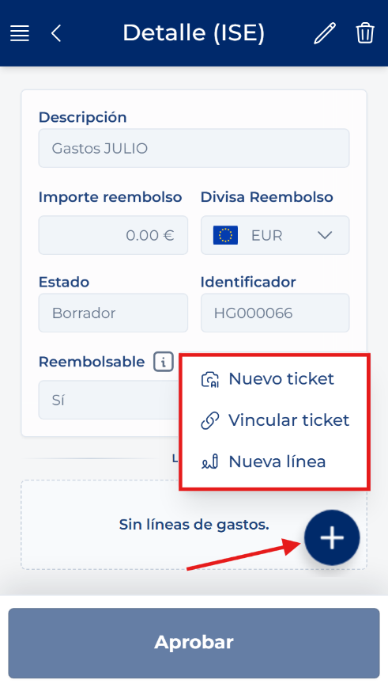
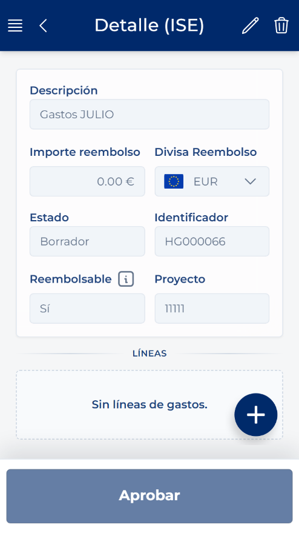

# Compreender o detalhe da folha de despesas

<!-- Fonte: Manual App CRM 1.5.docx, secção 8.5. -->

A parte superior contém os dados gerais: Descrição, Montante de reembolso, Moeda de reembolso, Estado, Identificador, Reembolsável, Projeto, Proprietário, quando aplicável, e Comentário de estado, caso exista. A parte inferior apresenta as linhas de despesa.

Em Rascunho e com permissões de edição, o botão de ações rápidas disponibiliza Novo ticket, Associar ticket e Nova linha. Quando a folha é só de leitura, estas opções não aparecem.

