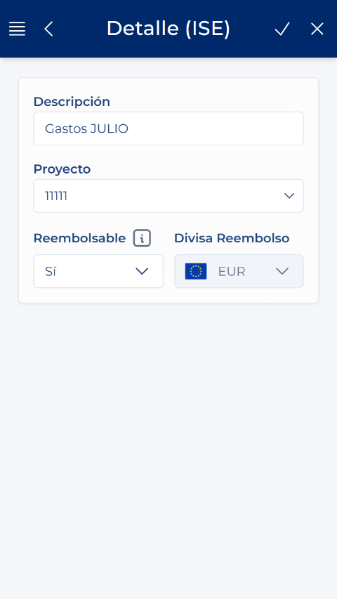

# Creare l'intestazione di una nota spese

<!-- Fonte: Manual App CRM 1.5.docx, sezione 8.4. -->

1. Nell'elenco, premere il pulsante Crea o il pulsante rotondo con il segno più.

2. Scrivere una Descrizione che consenta di riconoscere il motivo o il periodo delle spese. È obbligatoria.

3. Se previsto, selezionare un Progetto.

4. Indicare se la spesa è Rimborsabile. Questo valore verrà utilizzato come opzione iniziale nelle righe aggiunte successivamente.

5. Verificare Valuta rimborso. È determinata dalla società attiva e appare bloccata in questa schermata. La valuta specifica di ogni spesa verrà indicata successivamente nella relativa riga o nel ticket.

6. Premere Salva e confermare la creazione.

7. Attendere che venga visualizzato il dettaglio con un Identificatore. La nota spese viene creata nello stato Bozza e non contiene ancora righe.

ORDINE CORRETTO: Salvare prima l'intestazione. Successivamente, dal dettaglio della nota spese già creata, aggiungere righe o ticket. Non abbandonare la creazione prima di aver ottenuto l'identificatore della nota spese.
