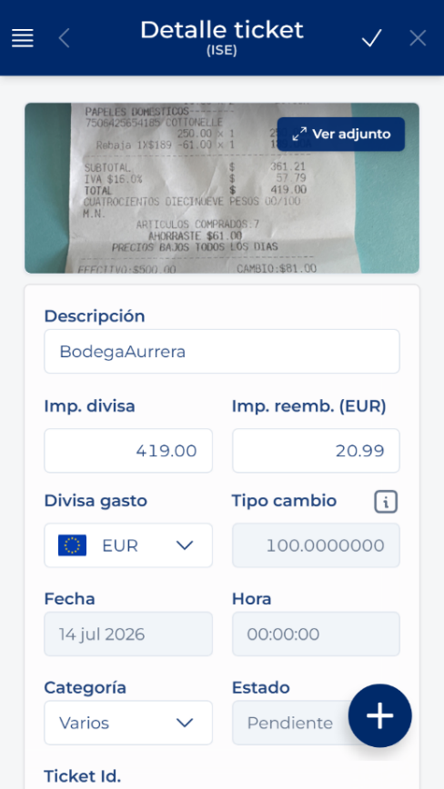
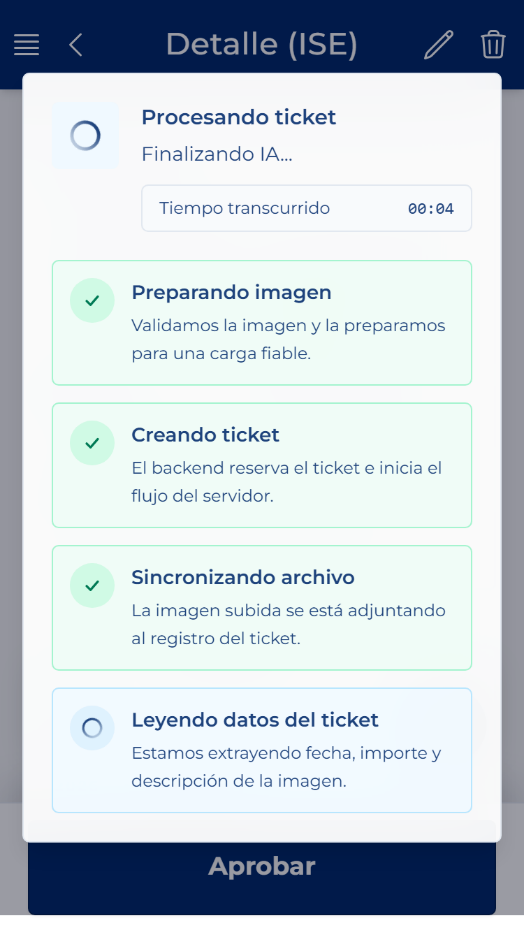
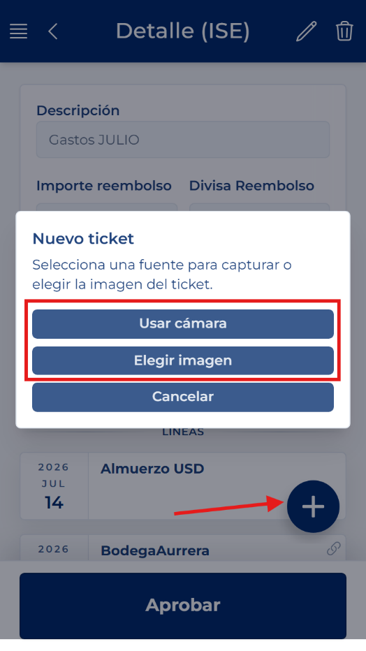

# Criar um ticket a partir de uma folha de despesas

<!-- Fonte: Manual App CRM 1.5.docx, secção 8.8. -->

1. Numa folha editável, abra Ações rápidas e prima Novo ticket.

2. Escolha Utilizar câmara para fotografar o comprovativo ou Escolher imagem para utilizar uma fotografia já guardada no dispositivo.

3. Certifique-se de que o ticket está completo, bem iluminado, sem reflexos e com o texto legível. Confirme a imagem e aguarde. A aplicação prepara o ficheiro, cria o ticket e tenta ler os seus dados através de IA.

4. No final, o ticket abre-se em modo de edição. Reveja a data, a moeda, o estabelecimento ou a descrição, os montantes, a categoria e as linhas reconhecidas. A IA ajuda a preencher os dados, mas o utilizador é responsável por verificá-los.

5. Prima Guardar. O ticket só fica associado à folha depois de este armazenamento ser concluído corretamente. Não feche nem volte atrás antes de o guardar e de se certificar de que os dados estão corretos.

NÃO ABANDONAR: Criar a imagem não conclui, por si só, o processo iniciado numa folha. O ticket abre-se para revisão e tem de ser guardado. Se sair sem guardar, poderá ficar pendente e não aparecer associado à folha. São aceites ficheiros JPG, JPEG, PNG e WEBP até 50 MB.
