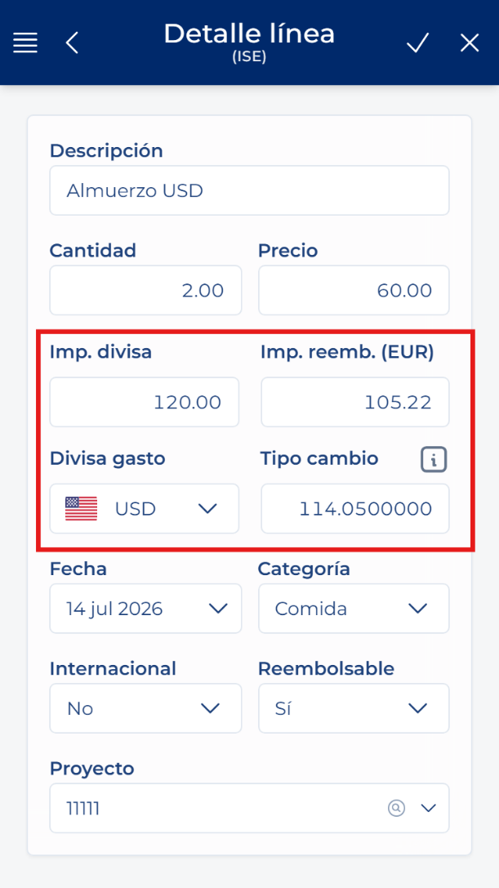
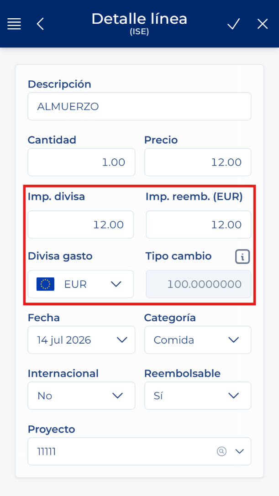

# 费用行的币种和金额

<!-- 来源：Manual App CRM 1.5.docx，第 8.7 节。 -->

“费用币种”是支付该金额时所用的货币。“报销币种”属于费用单，并取决于公司。“外币金额”表示原始费用，“报销金额”表示将计入费用单的金额。

如果两种币种相同，“汇率”会保持为 100，无需输入。如果币种不同，应用会尝试获取该日期对应的汇率。请检查结果；如果修改“汇率”或“报销金额”，请在保存前再次核对这两个值。

