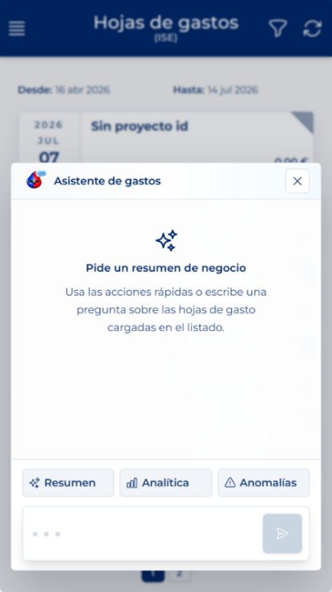

# Gastuen laguntzailea erabiltzea

<!-- Iturria: Manual App CRM 1.5.docx, 8.3.1 atala. -->

Zerrendak Gastuen laguntzailea irekitzeko botoi bat erakuts dezake inprimakiaren beheko ezkerreko atalean. Laguntzaile horrek uneko kontsultan kargatu diren orriak baino ez ditu aztertzen. Lehenik aplikatu iragazkiak eta itxaron karga amaitu arte; ondoren, ireki laguntzailea.

Laburpena, Analitika edo Anomaliak sakatu ditzakezu, edo kargatutako orriei buruzko galdera bat idatzi eta Bidali sakatu.

AA-REN ERABILERA ARDURATSUA: Laguntzaileak analisirako laguntza eskaintzen du eta huts egin dezake. Egiaztatu zenbatekoak, erabiltzaileak, proiektuak, dibisak eta egoerak jatorrizko txarteletan. Haren erantzunak ez du orririk onartzen, baztertzen edo aldatzen, eta ez du giza berrikuspena ordezten.
