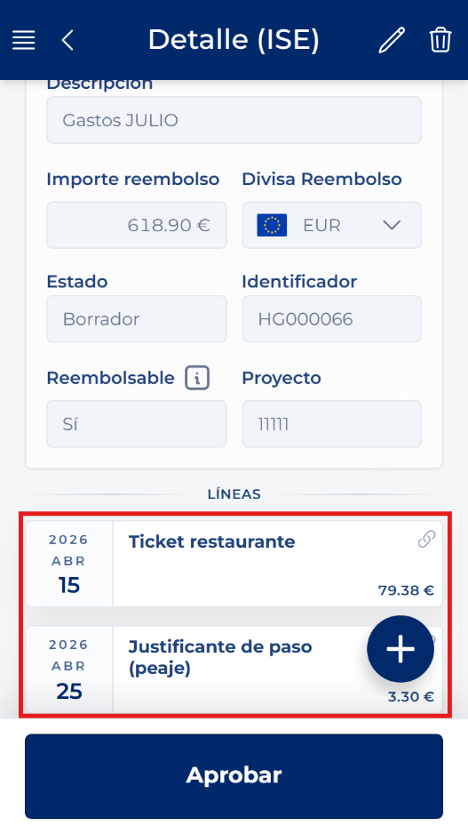
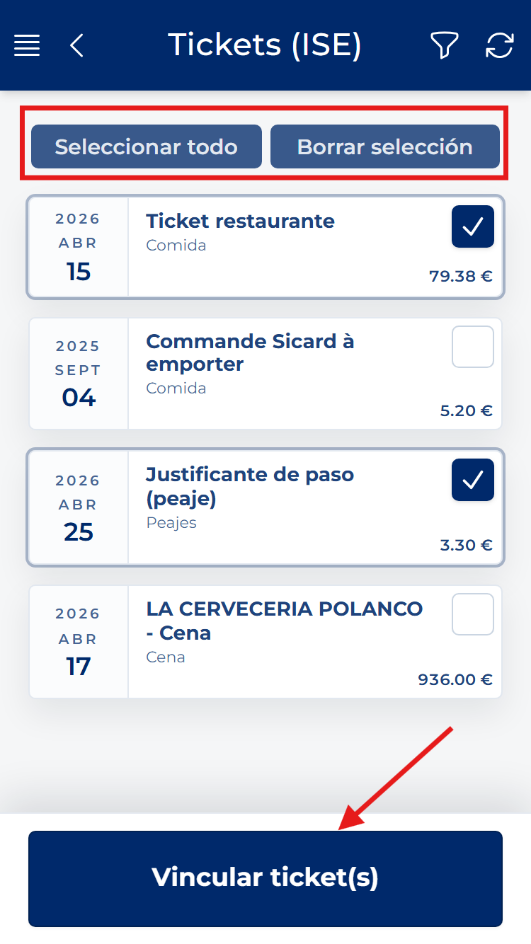
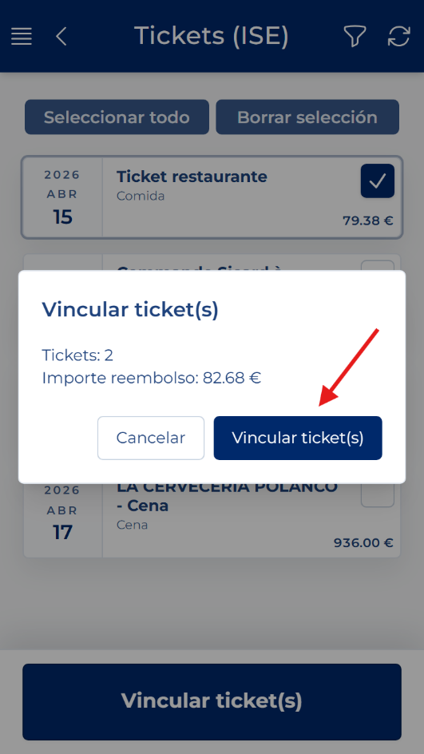

# Vincular tickets existentes

<!-- Fuente: Manual App CRM 1.5.docx, sección 8.9. -->

1. En una hoja editable, abra Acciones rápidas y pulse Vincular ticket.

2. Utilice los filtros si necesita localizar el ticket por código, estado, categoría o procesamiento por IA.

3. Marque uno o varios tickets disponibles. Revise la selección y el importe mostrado.

4. Pulse Vincular ticket(s) y confirme.

5. Lea el resultado. La aplicación indica cuántos fueron solicitados, vinculados, omitidos o fallidos. Si alguno falla, anote el motivo antes de cerrar.

ERRORES: Hemos habilitado la opción para modificar el ticket que pueda presentar problemas al vincular este a la hoja de gastos, lea atentamente el mensaje de error, corrija el ticket y repita el proceso de vinculación. Si el ticket cumple con todo lo necesario, este quedará vinculado.
