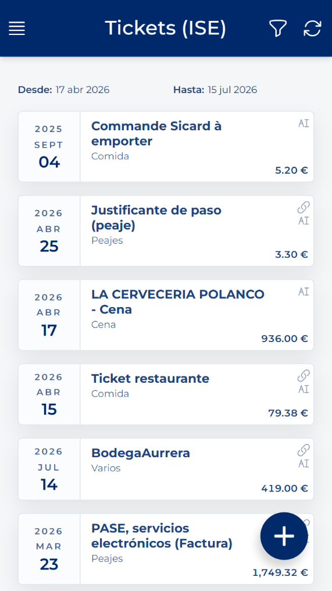
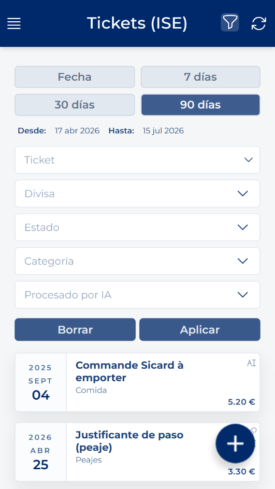

# Open and filter tickets

<!-- Source: CRM App Manual 1.5.docx, section 9.1. -->

1. Open the side menu.

2. Under EXPENSES, press Tickets.

3. Use Filter to search by Ticket, Status, Category, or Processed by AI. Press Apply to search or Clear to reset.

4. Press a card to open its details.

