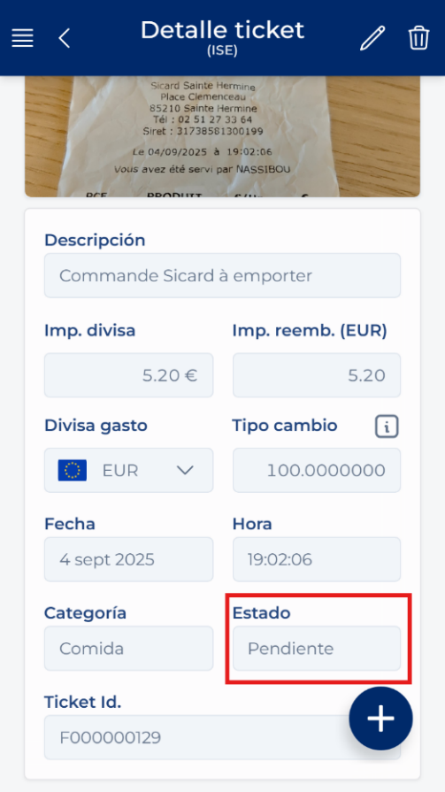
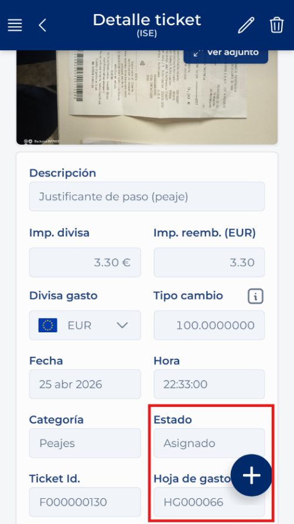
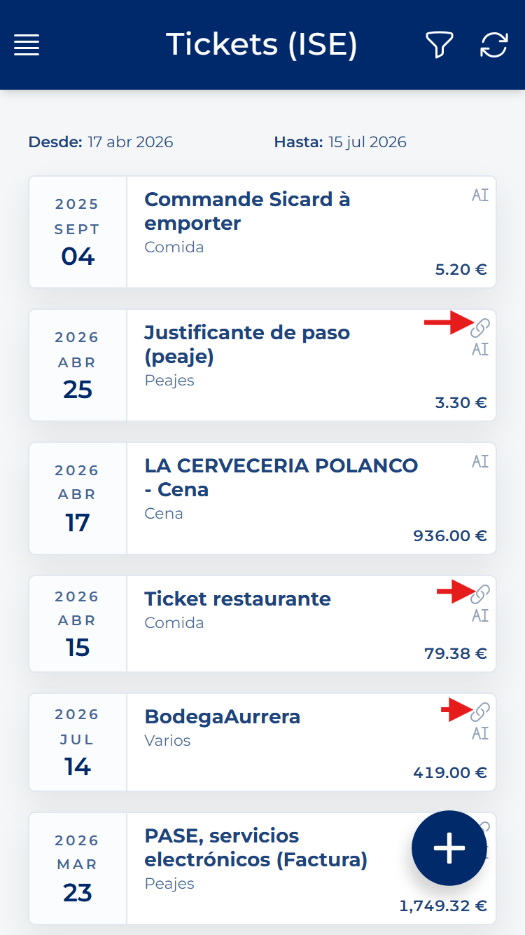

# Tiketaren egoera

<!-- Iturria: Manual App CRM 1.5.docx, 9.3 atala. -->

Zain egoeran dagoen tiketa oraindik ez dago orri bati esleituta. Esleituta egoeran dagoen tiketa gastu-orri bati lotuta dago jada. Lotura hori aldatu behar baduzu, une honetan tiketa deslotzeko aukera bakarra hura ezabatzea eta sistemara berriro kargatzea da, ondoren dagokion gastu-orriari berriro lotzeko.

