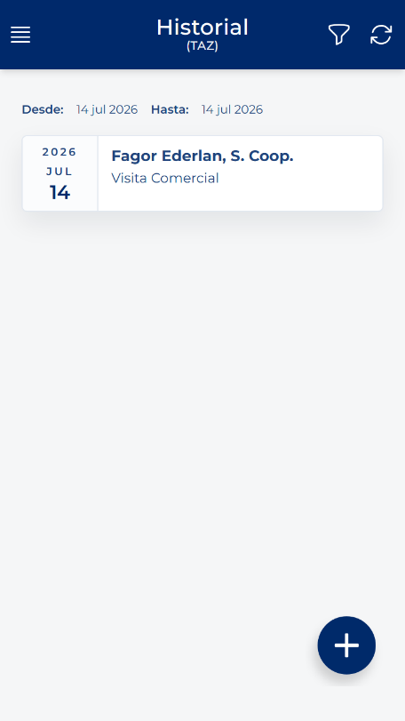
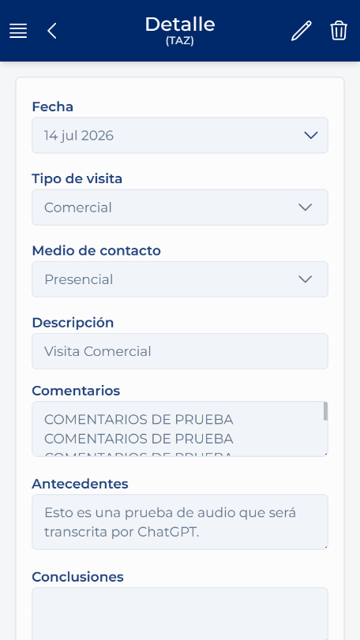

# 查看、编辑或删除拜访

<!-- 来源：Manual App CRM 1.5.docx，第 7.6 节。 -->

1. 在“记录”中，单击相应拜访的卡片。

2. 在“详细信息”页面中检查数据。

3. 如果显示“编辑”且需要更改活动，请单击该按钮，修改允许编辑的字段，然后单击“保存”。确认窗口出现时，请确认此操作。

4. 如果显示“删除”且您完全确定需要删除，请单击该按钮并阅读警告。请勿为了纠正一个小疑问而删除记录；如果不确定，请取消并先咨询。

创建期间使用的客户和联系人不是当前详细信息页面中的可编辑字段。如果拜访记录关联了错误的客户，请勿通过修改其他数据来假装属于另一客户；请遵循内部纠正流程。

