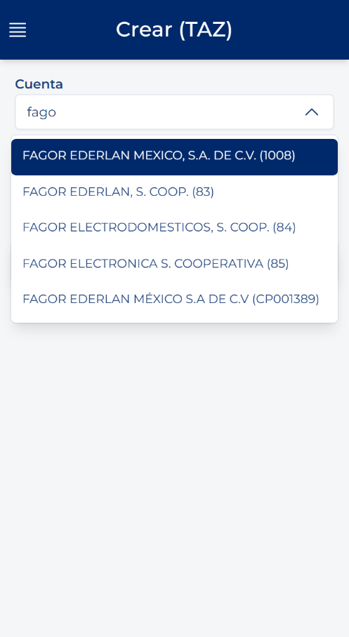
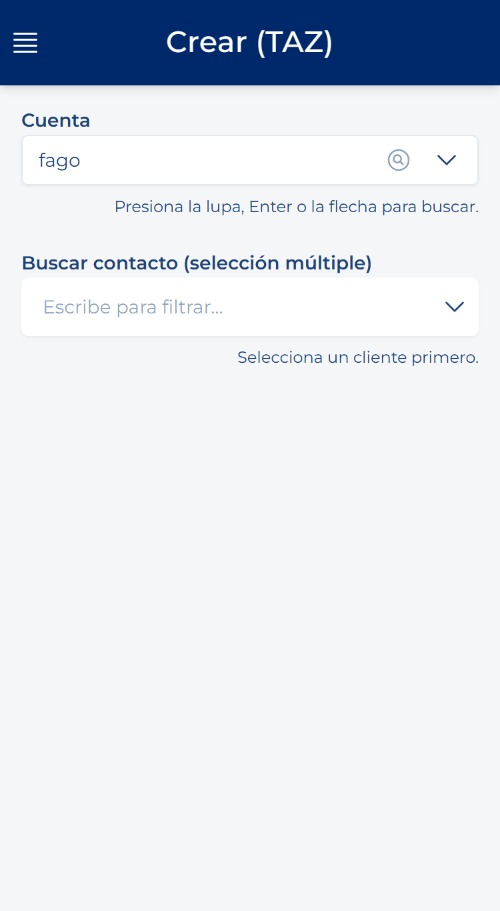
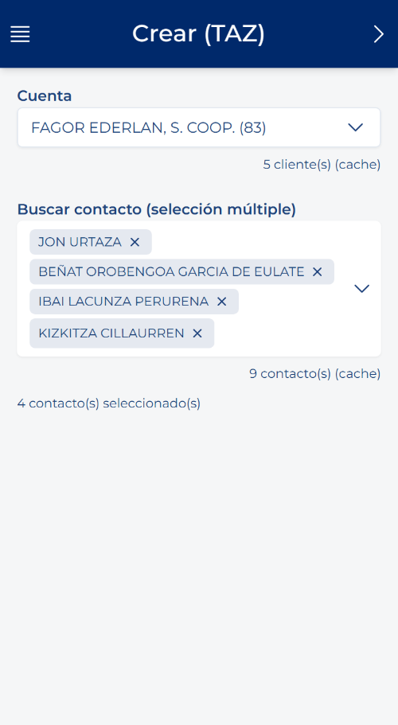

# 创建拜访：第 1 步，客户和联系人

<!-- 来源：Manual App CRM 1.5.docx，第 7.3 节。 -->

1. 在“记录”中，单击“创建”按钮或带加号的圆形按钮。

2. 在“客户”中输入要搜索的名称或代码的至少四个字符。然后单击放大镜、按 Enter 键或单击字段中的箭头。

3. 等待结果出现，然后单击正确的客户。

4. 如需关联联系人，请打开联系人字段并选择一个或多个联系人。联系人为可选项：即使不选择任何联系人，也可以创建拜访。

5. 单击“下一步”。

更换客户：如果在进入下一步后更换客户，应用会清除联系人和拜访数据，以免将信息关联到错误的客户。请重新检查表单。
