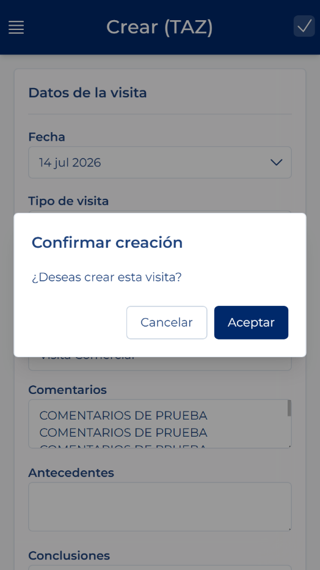
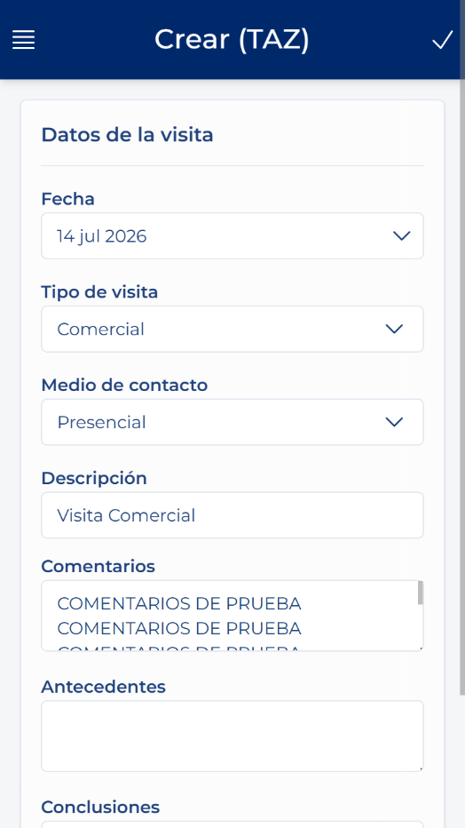

# 创建拜访：第 2 步，拜访信息

<!-- 来源：Manual App CRM 1.5.docx，第 7.4 节。 -->

1. 检查“日期”。系统默认建议使用当天日期。

2. 选择“拜访类型”。

3. 在适用时选择“联系方式”。

4. 输入简短的“说明”，最多 200 个字符。

5. 打开“备注”并输入此次拜访的主要说明。“备注”为必填项。“背景”和“结论”可在有助于提供信息时填写。

6. 检查必填字段：“客户”“拜访类型”“说明”和“备注”。联系人、联系方式、背景和结论即使留空也不会妨碍创建。

7. 单击顶部栏中的“创建”或“保存”。

8. 在“确认创建”中，检查问题，然后单击“接受”以创建拜访，或单击“取消”以返回表单。

