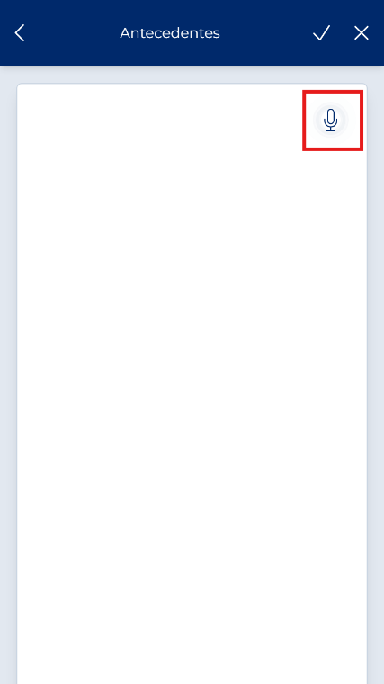
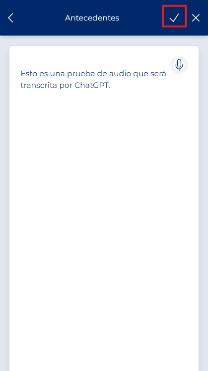
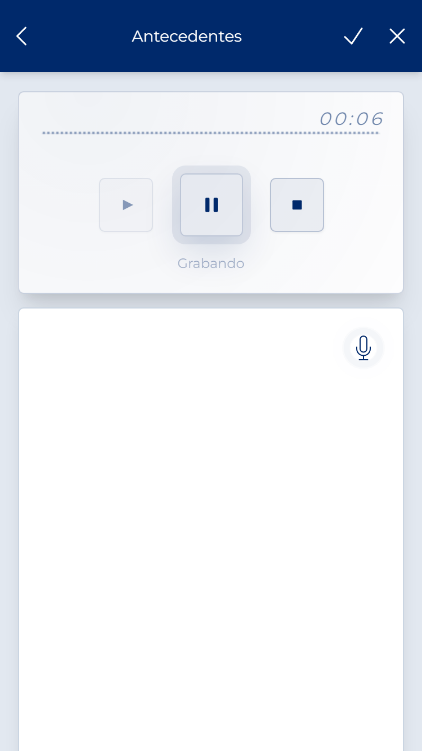

# Editor de texto y dictado

<!-- Fuente: Manual App CRM 1.5.docx, sección 7.5. -->

Al pulsar Comentarios, Antecedentes o Conclusiones se abre un editor a pantalla completa. Escriba el texto y pulse Guardar para devolverlo al formulario. Cuando el micrófono esté disponible en modo edición, puede dictar. Una nueva transcripción sustituye el contenido completo del editor; revise siempre el resultado antes de guardar porque puede contener palabras incorrectas.

