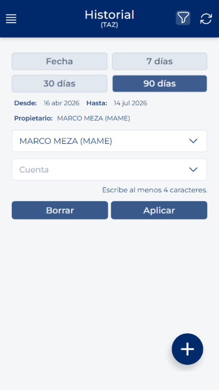

# Filtrare la cronologia delle visite

<!-- Fonte: Manual App CRM 1.5.docx, sezione 7.2. -->

1. Premere Filtro nella barra superiore.

2. Scegliere un periodo rapido, per esempio 7 giorni, 30 giorni o 90 giorni. È anche possibile scegliere Data per indicare un intervallo manuale.

3. Se necessario, selezionare un Account. Se si dispone di personale visibile, è anche possibile scegliere un Proprietario o l'opzione Tutti i miei subordinati.

4. Premere Applica per eseguire la ricerca.

5. Premere Cancella per rimuovere i filtri e ricominciare.

NAVIGAZIONE: Quando si apre una visita e si torna alla cronologia, l'applicazione tenta di conservare i filtri, la pagina e la posizione precedenti. Evitare di riaprire il menu dall'inizio se si desidera tornare allo stesso punto.
